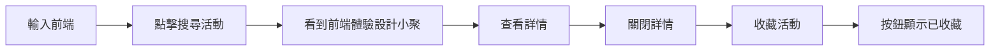

# Day 3：人類操作流程基準

## 固定資料

- 查詢：`前端`
- 預期活動：`前端體驗設計小聚`
- 預期識別碼：`event-frontend-summit`
- 預期收藏狀態：`已收藏`

## 文章截圖

1. 起始活動列表：`assets/day-01/event-site-baseline.png`
2. 搜尋結果：`assets/day-03/search-results.png`
3. 活動詳情：`assets/day-03/event-detail.png`
