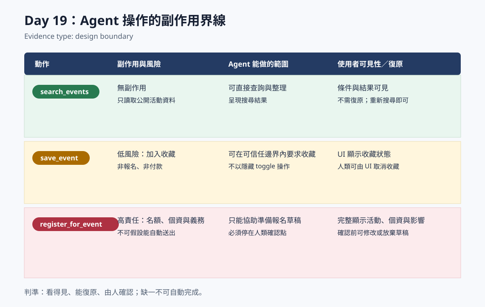

# Day 19：Agent 操作的副作用界線

> Evidence type: design boundary

## 本日可證明的事實

這是一份設計界線證據，不是功能錄製，也不代表高責任動作已經實作。它用來讓讀者在選擇 Agent 可執行的動作前，先辨識副作用、可見性與復原責任。

## 風險矩陣

| 動作 | 副作用與風險 | Agent 能做的範圍 | 使用者可見性 | 復原方式 |
|---|---|---|---|---|
| `search_events` | 無副作用；只讀取公開活動資料。 | 可直接查詢、整理與呈現搜尋結果。 | 搜尋條件與結果應在對話或頁面中可見。 | 不需復原；重新搜尋即可變更觀點。 |
| `save_event` | 低風險；只加入收藏，未來應可由人類 UI 取消收藏。 | 在既有可信任邊界與明確活動識別下，可要求加入收藏。 | 收藏狀態應由網站 UI 顯示，讓使用者知道資料已改變。 | 僅由人類 UI 提供取消收藏入口；Agent 不以隱藏 toggle 處理。 |
| `register_for_event` | 高責任；可能牽涉名額、個資、通知與後續義務。 | 不可自行送出；只能協助整理「準備報名」草稿。 | 網站必須完整顯示活動、個資與送出影響。 | 在人類確認前可修改或放棄草稿；送出後依網站既有規則處理。 |

## 不跨越的界線

- Agent 的便利性不構成代替人類承擔報名責任的理由。
- 高責任動作必須停在可檢視、可修改的人類確認點，而不是在對話中默默完成。
- 本日沒有新增工具、端點、付款流程或報名行為；矩陣只定義後續設計應遵守的判準。

## 讀者檢查點

若某個流程不能同時回答「使用者看得到什麼」「誰可以復原」「誰確認送出」，它就不應被視為可由 Agent 自動完成的動作。
