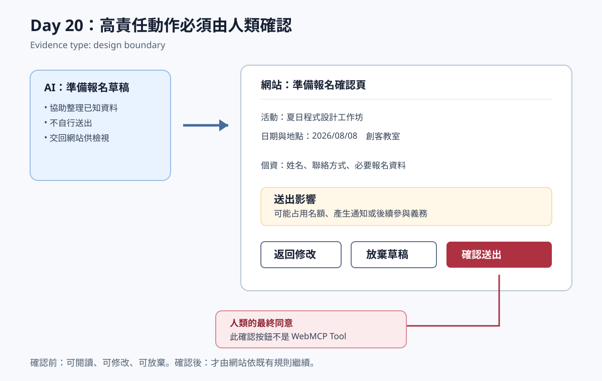

# Day 20：高責任動作必須由人類確認

> Evidence type: design boundary

## 本日可證明的事實

報名不是單純資料填寫。即使 AI 能根據使用者意圖準備內容，真正送出前仍須由網站提供一個使用者可閱讀、可修改且可放棄的確認畫面。

## 固定流程

1. AI 只能建立「準備報名」草稿，並將建議內容交回網站。
2. 網站顯示活動名稱、日期地點、即將使用的個資，以及送出後可能影響的名額、通知或義務。
3. 使用者可返回修改或放棄草稿。
4. 只有使用者在網站 UI 按下「確認送出」後，流程才可繼續。

## 為何確認按鈕不屬於 WebMCP Tool

「確認送出」承載的是人類的最終同意，不是 Agent 應代為執行的能力。它不應登錄為 WebMCP Tool，也不應透過對話自動觸發。這個界線同時保留了可理解性、責任歸屬與人工接手。

## 本日刻意未做的事

- 沒有新增任何 WebMCP Tool。
- 沒有新增報名的程式來源、HTTP 端點或付款流程。
- 沒有宣稱 SVG 是真實網站截圖或功能錄製。

本頁與 SVG 都是讀者可引用的設計證據：它們說明產品在實作前必須守住的確認邊界，而非模擬已完成的報名功能。
