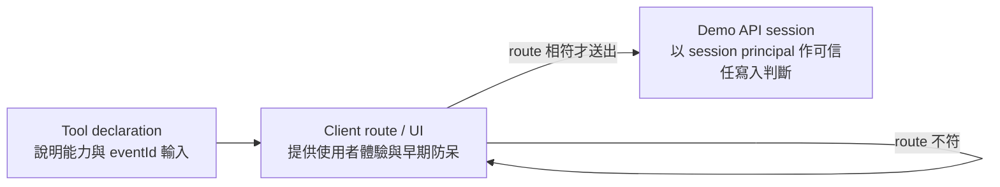

# Day 26｜以 server-side session 驗證可信任邊界

## 本日結論

Day 26 不新增 client user ID，也不把 DOM 或前端記憶體當成收藏事實。`save_event` 的輸入只有公開活動的 `eventId`；真正允許哪個收藏集合被讀寫，由 Demo API 從同源 `HttpOnly` session cookie 解析 principal 後決定。

本日測試補強的是可重跑的拒絕證據。新增測試第一次執行即通過，表示 Day 24–25 head 已具備這些 production 行為；因此本日沒有為了製造差異而改寫既有 production code。

## 三層責任圖



- **Tool declaration**：公開 `save_event` 能力、用途與 `eventId` schema；不宣告或接收 user ID。
- **Client route / UI**：route mismatch 時回傳 `ROUTE_MISMATCH` 並在 HTTP 前停止；UI 只呈現同步結果，不能自行建立 server 收藏事實。
- **Demo API session**：從 cookie 取得 principal；缺少或無效 session、偽造 identity 欄位、未知活動都由 server 回傳具名 `errorCode`。

限制必須與證據一起閱讀：

- 僅有單一測試 identity：`demo-reader`。
- session 與收藏皆為 in-memory state，server 重啟後會消失。
- 沒有 password、OAuth 或 database。
- 這不是 production security audit，也不代表完整認證或授權設計。

## 拒絕契約

| 情境 | HTTP status | `errorCode` | 資料狀態 |
| --- | ---: | --- | --- |
| 沒有 cookie | 401 | `UNAUTHENTICATED` | 合法 session 的收藏集合不變 |
| 無效 session cookie | 401 | `UNAUTHENTICATED` | 合法 session 的收藏集合不變 |
| `PUT` body 帶 `{ "userId": "another-user" }` | 400 | `UNEXPECTED_IDENTITY_FIELD` | 拒絕目標不會進入收藏集合 |
| 合法 session 收藏不存在的 event | 404 | `EVENT_NOT_FOUND` | 原收藏集合不變 |
| Tool / client 的 eventId 與目前 route 不符 | 不發 HTTP | `ROUTE_MISMATCH` | server state 不變 |

API tests 對每個 server 拒絕同時檢查 status、`errorCode` 與拒絕前後的收藏清單。Application test 把 `createSavedEventsApi` 接到 fetch spy，直接證明 route mismatch 時 fetch 呼叫次數為零，而不是只依測試名稱推論「沒有 HTTP」。

## Browser evidence：畫面不是 source of truth

`tests/browser/day-26-trusted-boundary.spec.ts` 使用真實 Demo API，不安裝 WebMCP test double，也不產出文章截圖。測試依序證明：

1. 先以 authenticated `GET /api/saved-events` 保存 server session 的基準回應。
2. 直接把活動詳情文字改成「已收藏（僅 DOM 假象）」並插入假收藏文字；此時再查 API，server 回應完全未變。
3. 由 browser 發出含 `{ "userId": "another-user" }` 的 `PUT`，server 回傳 `400 UNEXPECTED_IDENTITY_FIELD`。
4. 拒絕後再次查 API，收藏清單與基準一致，目標 eventId 不存在。
5. reload 後，DOM 假文字消失，UI 重新顯示 server session 的「尚未收藏」。

這裡的 DOM 修改只用來建立「畫面可以被本機改寫」的反例，不會描述成成功偽造請求；是否寫入成功仍只由 API response 與後續 session state 判斷。

## 可重跑指令

```powershell
npm.cmd exec vitest run tests/server/demo-api.test.ts tests/application/save-event.test.ts
npm.cmd exec playwright test tests/browser/day-26-trusted-boundary.spec.ts
```

首次補測結果：Vitest 2 files / 18 tests passed；Playwright 1 test passed。

由於拒絕行為原本已存在，另做可逆 mutation check 確認證據確實能攔截回歸：暫時關閉 `userId` 拒絕與 route mismatch guard 時，Vitest 出現 4 個預期失敗，Day 26 Playwright 也因收到 `200 ok` 而失敗；還原 production code 後，18 個 focused tests 與 Day 26 browser test 全數恢復通過。最終 production diff 為空。

## Reader snapshot 與文章邊界

Day 26 reader snapshot 已在文章對外發布前重發行：annotated tag
`v0.1.0-day-26` 與 convenience branch `day-26-server-authorization` 都指向
`ecf9082ccc9caba9538a65acee2a3f0cf52c88bf`。它包含 Day 25 對 raw Tool transport
string 的證據修正，以及 Day 26 原有的 server boundary tests。原本的
`fb07f4a0f784be25b9f66f58fd1fe4e77e7c4c02` 同時保留在
`archive/day-26-server-authorization-pre-raw-evidence` 與 annotated tag
`v0.1.0-day-26-pre-raw-evidence`。

2026-07-21 遠端 formal tag fresh clone 的整體 gate 為：Vitest 18 test files／85 tests
passed、Playwright 19 passed、typecheck 與 Vite build passed（19 modules transformed）。
外部文章必須以本文件的三個 server 拒絕 case 與一個 client early-stop case 對齊敘述，
且不得把 Demo API evidence 寫成 production authorization audit。
