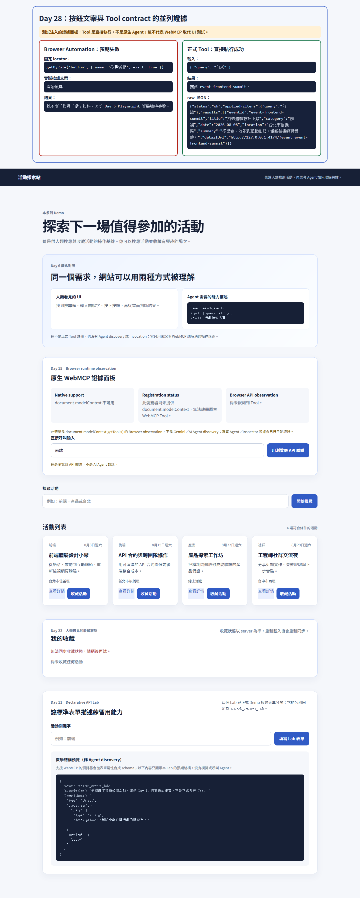

# Day 28：按鈕文案與正式 Tool contract 對照

## 固定條件

| 項目 | 此證據固定的條件 |
|---|---|
| Day 5 實驗 | `tests/experiments/day-05-button-copy.spec.ts` 原封不動，仍以 `getByRole('button', { name: '搜尋活動', exact: true })` 點擊按鈕。 |
| 頁面按鈕 | 目前實際可見文案是 `開始搜尋`。 |
| Tool contract | 沒有修改 `search_events` 名稱、描述或輸入 schema。 |
| 查詢與資料 | 兩端都使用 `{ "query": "前端" }`；沒有調整活動 catalog。 |

唯一的 Day 5 測試基礎設施修正，是讓 Playwright 正確啟動既有 Demo API 與 `dev:web -- --port 4173`。原本的 `npm run dev -- --port 4173` 會把 port 參數傳給 `concurrently`，造成 web server 未固定在 4173，無法先執行到 Day 5 的 locator。

## 預期失敗：保留 Day 5 的 Playwright 實驗

```text
npm run test:browser:button-copy

Test timeout of 4000ms exceeded.
Error: locator.click: Test timeout of 4000ms exceeded.
Call log:
  - waiting for getByRole('button', { name: '搜尋活動', exact: true })
```

失敗位置是 `tests/experiments/day-05-button-copy.spec.ts:6`。這是預期結果：固定的 UI locator 依賴舊按鈕文案，而頁面現在呈現的是「開始搜尋」。

完整的當次 Playwright 失敗輸出保存在 [day-28-day-05-failure.txt](assets/day-28-day-05-failure.txt)；其中 clone 的絕對路徑會以 `<project>` 正規化，讓讀者在不同下載路徑重跑後仍保持相同快照內容。

## 正式 Tool 直接執行：相同查詢仍有結果

```ts
const rawToolOutput = await createSearchEventsTool({ detailUrlFor })
  .execute({ query: '前端' });
```

保存的 raw JSON 位於 [day-28-tool-result.json](assets/day-28-tool-result.json)，其 `status` 為 `ok`，第一筆 `results[0].eventId` 為 `event-frontend-summit`。`detailUrl` 的 hostname 取決於擷取時的本機 Vite port；這裡驗證的穩定內容是 Tool 輸入、回傳狀態、canonical event ID 與 detail route，而非該 port。

## 並列截圖



截圖上方是**測試注入**的證據面板，下方才是未改動的 Demo 頁面。左欄保存 Browser Automation 找不到「搜尋活動」的原因；右欄保存正式 Tool 直接執行的 raw JSON。browser test 也會附加同一份 PNG 與 JSON，讓 CI 報告能保存當次執行產物。

## 這份證據證明與不證明的事

這份證據證明：`search_events` 的 contract 不會因為此頁按鈕由「搜尋活動」改為「開始搜尋」而改變，因此直接以相同 query 呼叫 Tool 仍能得到 `event-frontend-summit`。

它**不**證明 WebMCP 取代 UI 測試，也**不**證明真實原生 Agent 已完成任務。這裡的右欄是 Node test process 對正式 Tool 的直接呼叫，沒有使用 `document.modelContext`、browser test double 或 Agent runtime。UI 測試仍應覆蓋人類操作流程、可見文案、互動與版面；Tool contract 測試則保護網站提供給 Agent 的結構化能力。

## 可重跑入口

```bash
# 會把 Day 5 的 locator failure 視為預期結果，並驗證 Tool 與 browser 證據。
npm run test:day-28

# 重新生成 reader snapshot 內的 PNG 與 raw Tool JSON。
npm run capture:day-28
```
