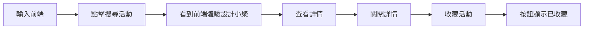

# Day 2–5 Baseline and Playwright Experiment Implementation Plan

> **For agentic workers:** REQUIRED SUB-SKILL: Use superpowers:subagent-driven-development (recommended) or superpowers:executing-plans to implement this plan task-by-task. Steps use checkbox (`- [ ]`) syntax for tracking.

**Goal:** 將活動網站的 Day 2–5 教材、可重現操作流程與按鈕文案實驗，做成四個可下載、可驗證的讀者快照。

**Architecture:** Day 2 與 Day 3 只補齊讀者執行與人類操作基準的文件，不新增 WebMCP 行為。Day 4 將正式 UI 回歸測試改用穩定的 `data-testid`，另外建立一支刻意用完整按鈕文字定位的獨立實驗測試。Day 5 只改搜尋按鈕的可見文案，保留實驗測試原封不動，產生可保存的預期失敗證據，同時讓正式回歸套件保持綠燈。

**Tech Stack:** TypeScript 5.9、Vite 8、Vitest 4、Playwright 1.61、Node.js 22.12 或更新版本。

## Global Constraints

- 所有讀者可見文字、文件與資料一律使用繁體中文。
- Day 1–5 不得加入 WebMCP 宣告、Agent discovery、Tool invocation、後端授權或任何後續日程功能。
- `day-XX-*` 是不可回寫的讀者快照；`main` 是整合線；快照只能指向已驗證的 commit。
- Day 5 的固定查詢是 `前端`，預期商業結果的識別碼是 `event-frontend-summit`。
- `tests/experiments/day-05-button-copy.spec.ts` 在 Day 4 與 Day 5 之間不得修改。
- Day 5 對 UI 的產品行為變更只有搜尋 submit 按鈕文字從 `搜尋活動` 改為 `開始搜尋`。
- `npm.cmd test`、`npm.cmd run typecheck`、`npm.cmd run build` 與 `npm.cmd run test:browser` 必須在每個快照通過。
- `npm.cmd run test:browser:button-copy` 在 Day 4 必須通過；在 Day 5 必須以找不到名稱完全等於 `搜尋活動` 的按鈕而失敗，這是預期實驗結果，不可把它包裝成通過的測試。
- Playwright 實驗產物只能寫入 `output/playwright/`，且不得提交。

---

### Task 1: Day 2 開發環境快照

**Files:**
- Create: `docs/day-02-environment.md`
- Create: `package-lock.json`
- Modify: `README.md`
- Modify: `docs/versioning.md`
- Test: `npm.cmd test`, `npm.cmd run typecheck`, `npm.cmd run build`, `npm.cmd run test:browser`

**Interfaces:**
- Consumes: `package.json` 的 Node.js `>=22.12.0` 與既有 `dev`、`test`、`typecheck`、`test:browser` scripts。
- Produces: 讀者可複製的安裝、啟動與四項驗證指令；`v0.1.0-day-02` 對應的環境快照說明。

- [ ] **Step 1: 以乾淨工作區安裝鎖定依賴**

Run: `npm.cmd install`

Expected: 建立 `package-lock.json`，且 npm 回報 `found 0 vulnerabilities`。

- [ ] **Step 2: 撰寫 Day 2 環境文件**

Create `docs/day-02-environment.md` with these exact sections and commands:

````markdown
# Day 2：本機開發環境

## 需要的工具

- Node.js 22.12 或更新版本
- Git
- 支援 Chromium 的 Playwright 瀏覽器

## 安裝與啟動

```powershell
npm install
npm run dev
```

## 基本驗證

```powershell
npm test
npm run typecheck
npm run build
npm run test:browser
```

## 最小排查順序

1. 用 `node --version` 確認 Node.js 版本。
2. 刪除目前終端後重新執行 `npm install`。
3. 確認開發伺服器顯示的網址可在本機瀏覽器開啟。
4. 若 Playwright 缺少瀏覽器，執行 `npx playwright install chromium` 後重試。
````

- [ ] **Step 3: 讓 README 將 Day 2 作為共同起點**

Replace the Day 1-specific clone-and-run wording with a short Day 1–2 section that keeps this clone command and links to `docs/day-02-environment.md`:

```powershell
git clone --branch day-02-environment <repository-url>
Set-Location AgentReady-Events-V2
npm install
npm run dev
```

The README must still state that Day 1 contains no WebMCP behavior.

- [ ] **Step 4: 更新版本表的 Day 2 狀態**

In `docs/versioning.md`, change only the Day 2 status to `已建立`.

- [ ] **Step 5: 執行完整 Day 2 驗證**

Run: `npm.cmd test; npm.cmd run typecheck; npm.cmd run build; npm.cmd run test:browser`

Expected: Vitest 2 tests passing, TypeScript exits 0, Vite build exits 0, Playwright browser suite exits 0.

- [ ] **Step 6: Commit**

```bash
git add README.md docs/day-02-environment.md docs/versioning.md package-lock.json
git commit -m "docs(day-02): add reproducible local environment guide"
```

### Task 2: Day 3 人類操作基準快照

**Files:**
- Create: `docs/day-03-human-flow.md`
- Modify: `docs/versioning.md`
- Test: `tests/browser/event-explorer.spec.ts`

**Interfaces:**
- Consumes: 活動網站既有的搜尋、詳情與收藏 UI。
- Produces: 固定人類流程「搜尋 → 查看詳情 → 收藏」及三張對應文章截圖的拍攝規格。

- [ ] **Step 1: 撰寫 Day 3 操作文件**

Create `docs/day-03-human-flow.md` with this flow and fixed expected state:

````markdown
# Day 3：人類操作流程基準



## 固定資料

- 查詢：`前端`
- 預期活動：`前端體驗設計小聚`
- 預期識別碼：`event-frontend-summit`
- 預期收藏狀態：`已收藏`

## 文章截圖

1. 起始活動列表：`assets/day-01/event-site-baseline.png`
2. 搜尋結果：`assets/day-03/search-results.png`
3. 活動詳情：`assets/day-03/event-detail.png`
````

- [ ] **Step 2: 執行人類流程的瀏覽器回歸測試**

Run: `npm.cmd run test:browser -- tests/browser/event-explorer.spec.ts`

Expected: 1 Playwright test passing; it fills `前端`, opens details, closes the dialog, and observes `已收藏`.

- [ ] **Step 3: 更新版本表的 Day 3 狀態**

In `docs/versioning.md`, change only the Day 3 status to `已建立`.

- [ ] **Step 4: Commit**

```bash
git add docs/day-03-human-flow.md docs/versioning.md
git commit -m "docs(day-03): record human event exploration flow"
```

### Task 3: Day 4 Playwright 與文字定位實驗基準

**Files:**
- Create: `docs/day-04-playwright.md`
- Create: `playwright.button-copy-experiment.config.ts`
- Create: `tests/experiments/day-05-button-copy.spec.ts`
- Modify: `package.json`
- Modify: `src/main.ts`
- Modify: `tests/browser/event-explorer.spec.ts`
- Modify: `.gitignore`
- Modify: `docs/versioning.md`
- Test: `tests/browser/event-explorer.spec.ts`, `tests/experiments/day-05-button-copy.spec.ts`

**Interfaces:**
- Consumes: `#event-search-form`, `#event-search`, `event-frontend-summit`, and the search submit button.
- Produces: `data-testid="search-events-button"` on the formal UI test target and the immutable Day 5 experiment command `npm.cmd run test:browser:button-copy`.

- [ ] **Step 1: 寫正式回歸測試的 RED 測試**

In `tests/browser/event-explorer.spec.ts`, replace the submit locator with this exact pair of assertions before changing production code:

```ts
await page.getByTestId('search-events-button').click();
await expect(page.locator('article[data-event-id="event-frontend-summit"]')).toBeVisible();
```

Run: `npm.cmd run test:browser -- tests/browser/event-explorer.spec.ts`

Expected: FAIL because the search button does not yet have `data-testid="search-events-button"` and the event card does not yet expose its event id.

- [ ] **Step 2: 寫最小 GREEN 實作**

Make only these two markup changes in `src/main.ts`:

```html
<button type="submit" data-testid="search-events-button">搜尋活動</button>
<article class="event-card" data-event-id="${event.id}">
```

Run: `npm.cmd run test:browser -- tests/browser/event-explorer.spec.ts`

Expected: PASS; the formal regression remains concerned with a human capability and fixed business result, not the exact visible copy.

- [ ] **Step 3: 建立 Day 5 不可變的文字定位實驗**

Create `tests/experiments/day-05-button-copy.spec.ts` with exactly this body:

```ts
import { expect, test } from '@playwright/test';

test('搜尋按鈕完整文案可驅動固定活動查詢', async ({ page }) => {
  await page.goto('/');
  await page.getByLabel('搜尋活動').fill('前端');
  await page.getByRole('button', { name: '搜尋活動', exact: true }).click();

  await expect(page.locator('article[data-event-id="event-frontend-summit"]')).toBeVisible();
});
```

Create `playwright.button-copy-experiment.config.ts` with this exact content:

```ts
import { defineConfig } from '@playwright/test';

const baseURL = process.env.PLAYWRIGHT_BASE_URL ?? 'http://127.0.0.1:4173';
const usesExternalServer = process.env.PLAYWRIGHT_BASE_URL !== undefined;

export default defineConfig({
  testDir: './tests/experiments',
  timeout: 4_000,
  reporter: 'line',
  outputDir: './output/playwright/day-05',
  use: {
    baseURL
  },
  webServer: usesExternalServer
    ? undefined
    : {
        command: 'npm.cmd run dev -- --port 4173',
        url: 'http://127.0.0.1:4173',
        reuseExistingServer: true
      }
});
```

Add this `package.json` script:

```json
"test:browser:button-copy": "playwright test --config playwright.button-copy-experiment.config.ts"
```

Add `output/playwright/` to `.gitignore`.

Run: `npm.cmd run test:browser:button-copy`

Expected: PASS on Day 4 because the button still has the exact name `搜尋活動`.

- [ ] **Step 4: 撰寫 Day 4 說明文件**

Create `docs/day-04-playwright.md` with the following requirements:

````markdown
# Day 4：Playwright 與頁面定位

Playwright 讓測試程式透過瀏覽器操作頁面；它不是 AI 專用工具，也沒有理解網站商業意圖。

## 兩種 locator 的角色

- `getByRole('button', { name: '搜尋活動', exact: true })`：Day 5 的教學實驗，故意把完整文案當成定位契約。
- `getByTestId('search-events-button')`：正式回歸測試的穩定識別碼，仍需搭配活動結果斷言驗證人類流程。

## 執行

```powershell
npm run test:browser
npm run test:browser:button-copy
```
````

- [ ] **Step 5: 更新版本表、驗證與 commit**

Change only the Day 4 status in `docs/versioning.md` to `已建立`.

Run: `npm.cmd test; npm.cmd run typecheck; npm.cmd run build; npm.cmd run test:browser; npm.cmd run test:browser:button-copy`

Expected: all commands exit 0.

```bash
git add .gitignore docs/day-04-playwright.md docs/versioning.md package.json playwright.button-copy-experiment.config.ts src/main.ts tests/browser/event-explorer.spec.ts tests/experiments/day-05-button-copy.spec.ts
git commit -m "test(day-04): add Playwright locator experiment baseline"
```

### Task 4: Day 5 按鈕文案改名與預期失敗證據

**Files:**
- Create: `docs/evidence/day-05-button-copy.md`
- Modify: `src/main.ts`
- Modify: `docs/versioning.md`
- Test: `tests/experiments/day-05-button-copy.spec.ts` unchanged from Task 3

**Interfaces:**
- Consumes: Task 3 的不可變實驗測試與 `data-testid="search-events-button"` 正式回歸測試。
- Produces: 可重現的文字 locator 失敗紀錄；正式回歸套件仍可驗證相同 `event-frontend-summit` 結果。

- [ ] **Step 1: 驗證實驗在 Day 4 基線成功**

Run: `npm.cmd run test:browser:button-copy`

Expected: 1 test passing, query `前端` returns visible `[data-event-id="event-frontend-summit"]`.

- [ ] **Step 2: 只改搜尋按鈕的可見文字**

In `src/main.ts`, make this exact one-line UI change and no changes to `tests/experiments/day-05-button-copy.spec.ts`:

```html
<button type="submit" data-testid="search-events-button">開始搜尋</button>
```

- [ ] **Step 3: 保存預期失敗證據**

Run: `npm.cmd run test:browser:button-copy`

Expected: non-zero exit and a timeout/error showing that Playwright cannot find `getByRole('button', { name: '搜尋活動', exact: true })` while the UI now renders `開始搜尋`.

Create `docs/evidence/day-05-button-copy.md` with this exact interpretation:

````markdown
# Day 5：按鈕文案改名實驗

## 固定條件

- 查詢：`前端`
- 預期商業結果：`event-frontend-summit`
- 未改動的實驗測試：`tests/experiments/day-05-button-copy.spec.ts`
- 唯一 UI 變更：搜尋 submit 按鈕由 `搜尋活動` 改為 `開始搜尋`

## 指令與結果

```powershell
npm run test:browser:button-copy
```

此指令在 Day 4 通過，在 Day 5 預期失敗：locator 依賴完整按鈕文案，網站的搜尋能力與資料結果本身並沒有消失。

## 不應得出的結論

這個實驗只證明一種 locator 對 UI 文案敏感；它不證明所有 Browser Automation 都不可靠，也不代表 WebMCP 已經解決所有網站自動化問題。
````

- [ ] **Step 4: 驗證正式回歸套件仍通過**

Run: `npm.cmd test; npm.cmd run typecheck; npm.cmd run build; npm.cmd run test:browser`

Expected: every command exits 0; the formal browser test uses `data-testid="search-events-button"` and still observes `event-frontend-summit`.

- [ ] **Step 5: 更新版本表與 commit**

Change only the Day 5 status in `docs/versioning.md` to `已建立`.

```bash
git add docs/evidence/day-05-button-copy.md docs/versioning.md src/main.ts
git commit -m "experiment(day-05): record button copy locator failure"
```

## Snapshot Handoff

After the four tasks have passed review and the work branch is merged locally, create immutable snapshots from their respective verified commits:

```powershell
$day02 = git log main --format=%H --fixed-strings --grep='docs(day-02): add reproducible local environment guide' -1
$day03 = git log main --format=%H --fixed-strings --grep='docs(day-03): record human event exploration flow' -1
$day04 = git log main --format=%H --fixed-strings --grep='test(day-04): add Playwright locator experiment baseline' -1
$day05 = git log main --format=%H --fixed-strings --grep='experiment(day-05): record button copy locator failure' -1

if ([string]::IsNullOrWhiteSpace($day02) -or [string]::IsNullOrWhiteSpace($day03) -or [string]::IsNullOrWhiteSpace($day04) -or [string]::IsNullOrWhiteSpace($day05)) {
  throw '找不到 Day 2–5 的已驗證 commit。'
}

git branch day-02-environment $day02
git tag v0.1.0-day-02 $day02
git branch day-03-human-flow $day03
git tag v0.1.0-day-03 $day03
git branch day-04-playwright $day04
git tag v0.1.0-day-04 $day04
git branch day-05-button-copy-experiment $day05
git tag v0.1.0-day-05 $day05

git show-ref --verify refs/heads/day-02-environment
git show-ref --verify refs/tags/v0.1.0-day-02
git show-ref --verify refs/heads/day-03-human-flow
git show-ref --verify refs/tags/v0.1.0-day-03
git show-ref --verify refs/heads/day-04-playwright
git show-ref --verify refs/tags/v0.1.0-day-04
git show-ref --verify refs/heads/day-05-button-copy-experiment
git show-ref --verify refs/tags/v0.1.0-day-05
```

The exact commit messages make the snapshot commands deterministic after the local merge.
